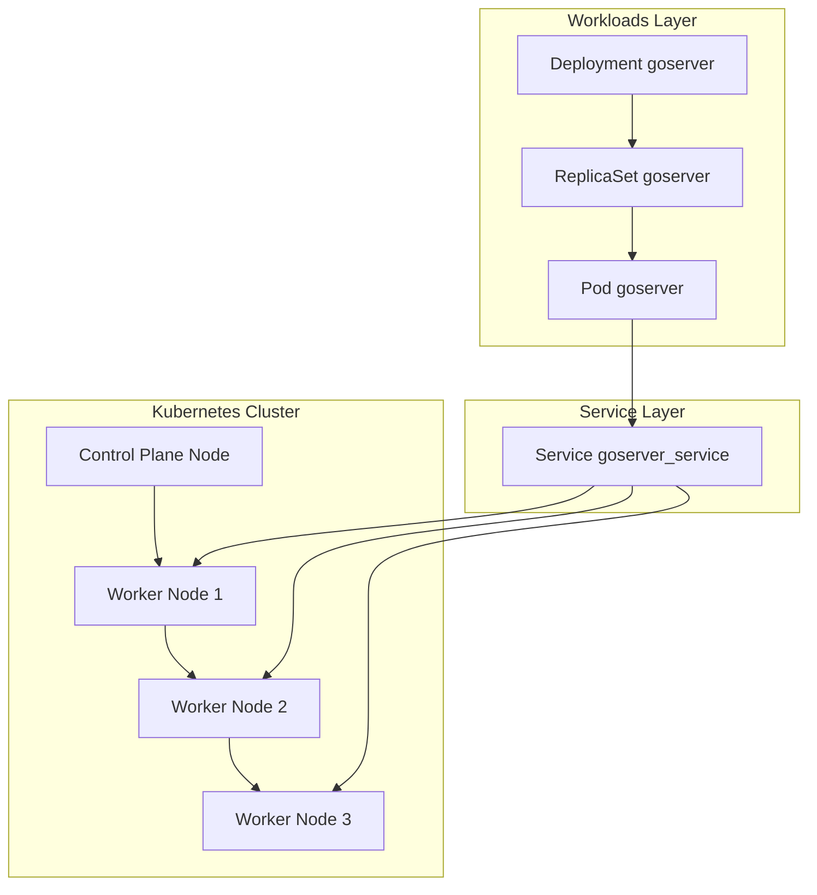

# Projeto de Aprendizado Kubernetes - FullCycle 3.0

## Descrição

Este repositório contém os materiais e exercícios práticos desenvolvidos durante o curso FullCycle 3.0, focado no aprendizado de Kubernetes. O projeto tem como objetivo consolidar conhecimentos sobre orquestração de containers e gerenciamento de aplicações em ambientes distribuídos.

## Objetivos de Aprendizado

- Compreender os conceitos fundamentais do Kubernetes
- Aprender a criar e gerenciar clusters Kubernetes
- Dominar o uso de Pods, Services, Deployments e outras primitivas
- Implementar estratégias de deployment e rollback
- Configurar networking e storage no Kubernetes
- Aplicar boas práticas de segurança e monitoramento

## Estrutura do Projeto

O repositório está organizado em módulos que seguem a progressão do curso, cada um contendo:

- Arquivos de manifesto YAML
- Exemplos práticos de configuração
- Exercícios resolvidos
- Anotações e documentação complementar

## Pré-requisitos

- Docker instalado e configurado
- Kind instalado
- kubectl CLI
- Acesso a um cluster Kubernetes (local ou cloud)
- Conhecimentos básicos de containers

## Como Utilizar

1. Clone este repositório
2. Navegue pelos diretórios organizados por tópico
3. Execute os exemplos seguindo as instruções em cada módulo
4. Pratique modificando as configurações conforme necessário

## Recursos Adicionais

- [Documentação oficial do Kubernetes](https://kubernetes.io/docs/)
- [FullCycle 3.0](https://fullcycle.com.br/)

## Contribuição

Este é um projeto de estudo pessoal, mas sugestões e melhorias são sempre bem-vindas através de issues ou pull requests.

## Diagrama

